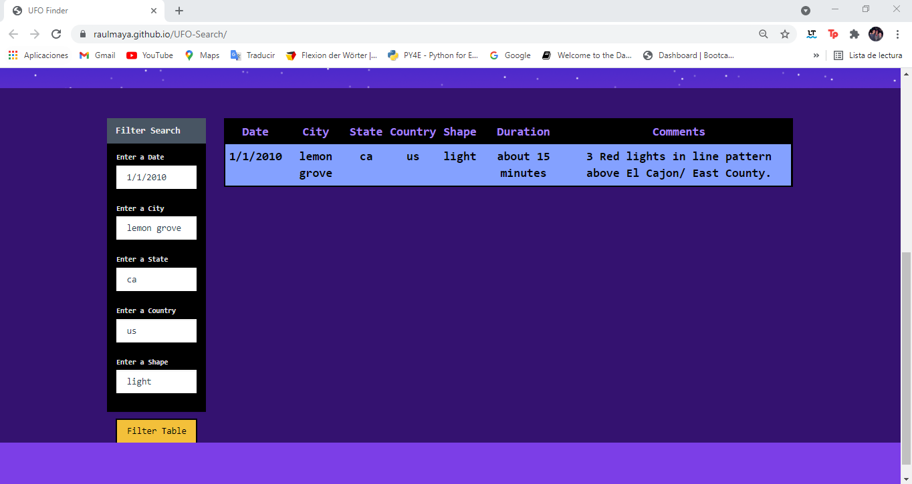

<h1><u>UFO Search</u></h1>

### Tools:
 * JavaScript
 * D3.js
 * HTML
 * CSS

 

 ### Background

 The USA Government provide a [dataset](UFO-Level-2/StarterCode/static/js/data.js) with several UFO Sights across the world. The problem is that there is a lot of data stored in the [dataset](UFO-Level-2/StarterCode/static/js/data.js), that it makes really difficult to look for a specific sight. So, we need you to write code that will create a table dynamically based upon a dataset we provide. We also need to allow our users to filter the table data for specific values. There's a catch though we only use pure JavaScript, HTML, and CSS, and D3.js on our web pages.

 

 ### How the page work?

 * The page is upload in Git Hub Pages, as [UFO-FINDER](https://raulmaya.github.io/UFO-Search/)
 
  

 * When you open the [UFO-FINDER](https://raulmaya.github.io/UFO-Search/) page you will get a starting index page, like this:
 
  

 * If you scroll down a little bit, you will get the complete table, powered by the [dataset](UFO-Level-2/StarterCode/static/js/data.js):
 
  

 * In the filter control in your left, you will find that you can filter by:
  * Date:
    
     

  * City:
    
     

  * State:
    
     

  * Country:
    
     

  * Shape:
    
     

  * Or all of them:
  
  

### Contact:

* Name: Raul Maya Salazar
* Phone: +52 833 159 7006
* E-mail: raulmayas20@gmail.com
* GitHub: https://github.com/RaulMaya
* LinkedIn: https://www.linkedin.com/in/raul-maya/

